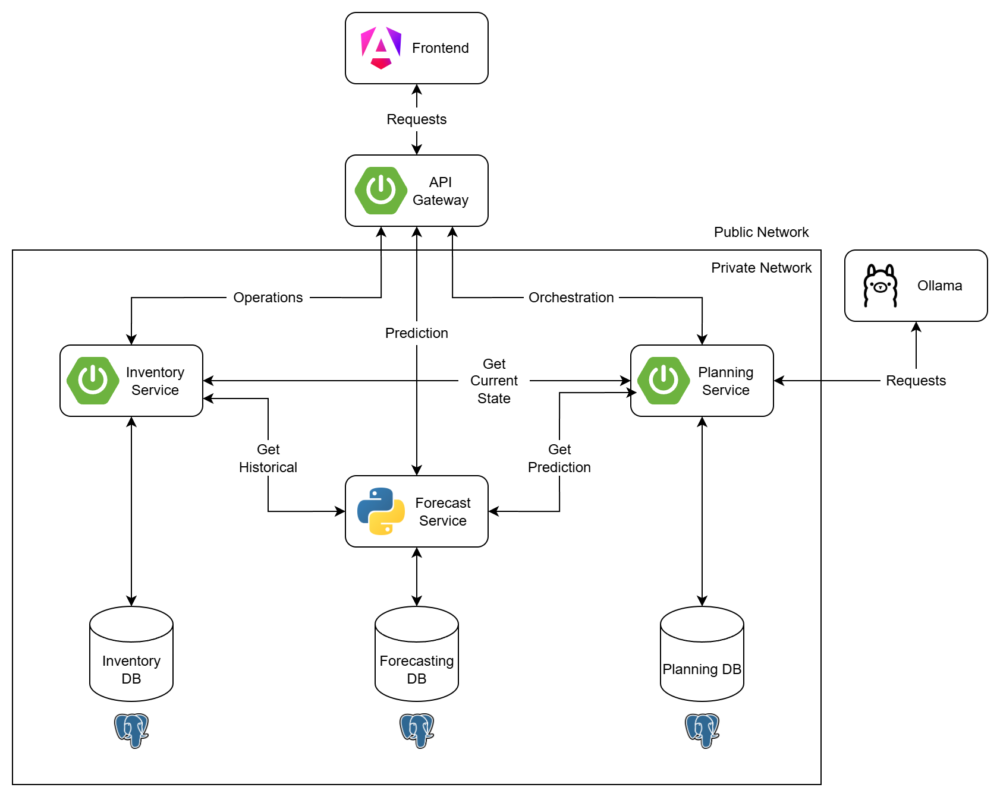
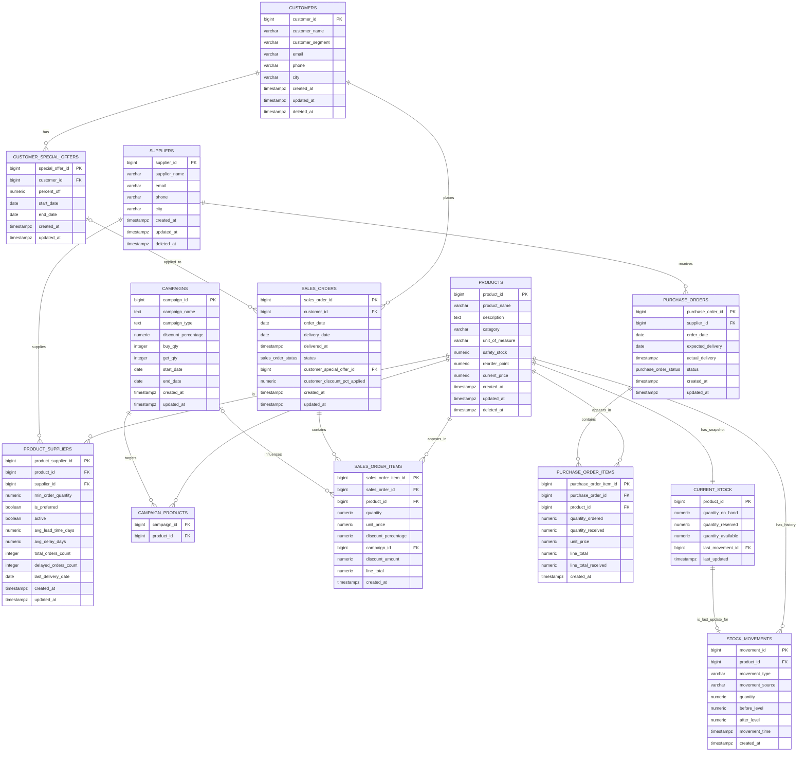
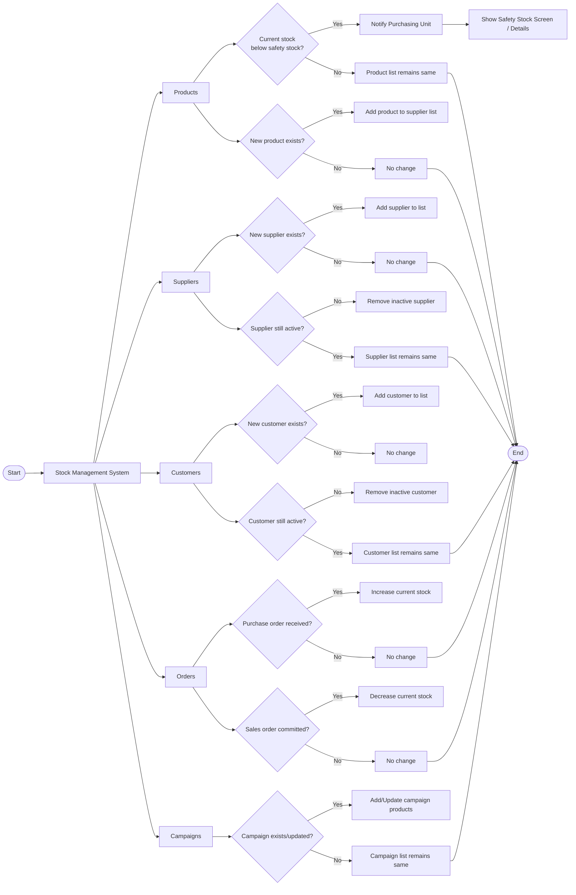

# 📦 Inventory Management System

A full-stack, modular **Inventory & Planning platform** featuring an **Angular frontend**, **Spring Boot microservices**, a **Python forecasting service**, and **PostgreSQL databases**.  
It covers daily stock operations (products, suppliers, customers, orders, campaigns), time-series forecasting, and replenishment planning — with optional **LLM-assisted insights via Ollama**.

Repo: [inventory-management-system](https://github.com/KasimDeliaci/inventory-management-system)

---

## 🚀 Features

- **Products / Suppliers / Customers / Orders / Campaigns**
- **Stock Movements & Current Stock Snapshots**
- **Sales Reporting** (daily, range-based)
- **Forecast Service** (7-day / 14-day demand forecasts)
- **Planning Service** with orchestration and recommendations
- **Optional Ollama LLM** for natural-language stock planning
- **Modern Angular UI** with CRUD forms, tables, and status indicators

---

## 🏗️ Architecture

- **Frontend** → Angular app (requests through API Gateway)
- **API Gateway** → Entry point, routes to internal services
- **Inventory Service (Spring Boot)** → CRUD, stock ops, reporting
- **Forecast Service (Python)** → Historical data, ML/forecasting
- **Planning Service (Spring Boot)** → Combines current state + predictions → recommendations
- **Databases** → PostgreSQL (Inventory, Forecasting, Planning)

---

## 🗂️ Database Design

Highlights:
- **products**, **suppliers**, **customers**
- **sales_orders / sales_order_items**
- **purchase_orders / purchase_order_items**
- **campaigns / campaign_products**
- **stock_movements** (history)
- **current_stock** (real-time snapshot)

---

## 💻 Frontend Mockups

[Figma](https://www.figma.com/proto/7DF2uo0ZNED65x62reHOrr/Talep-Tahmini-ve-Stok-Yönetimi-Projesi?page-id=16%3A7&node-id=16-8&p=f&viewport=-809%2C102%2C0.61&t=Vn6HKj9Hii36xQXt-1&scaling=min-zoom&content-scaling=fixed&starting-point-node-id=16%3A8)

---

## 🔄 Flow Example

---

## ⚙️ Local Development
Requirements
- Node.js 18+ / npm or pnpm
- Java 17+ (Spring Boot)
- Python 3.10+ (Forecast service)
- PostgreSQL 14+
- Docker

---

## SETUP

### Frontend
- cd frontend
- npm install
- npm start

### Inventory Service
- cd inventory-service
- ./mvnw spring-boot:run

### Planning Service
- cd planning-service
- ./mvnw spring-boot:run

### Forecast Service
- cd forecast-service
- python -m venv .venv && source .venv/bin/activate
- pip install -r requirements.txt
- python app.py

### Databases can be started with Docker

---

## 🛠️ Tech Stack
- Frontend: Angular 20
- Backend Services: Spring Boot (Inventory, Planning, Gateway)
- Forecasting: Python (FastAPI/Flask + ML/Stats)
- Database: PostgreSQL
- AI Integration: Ollama

---

## 👥 Contributors
- [Eren GÜRELİ](https://www.linkedin.com/in/eren-gureli/)
- [Irmak Aslan](https://www.linkedin.com/in/irmak-aslan/)
- [Kasım Deliacı](https://www.linkedin.com/in/kasimdeliaci/)
- [Yiğit Şevki Kaplan](https://www.linkedin.com/in/yigitskaplan/)
